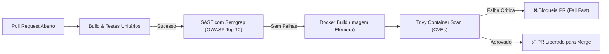
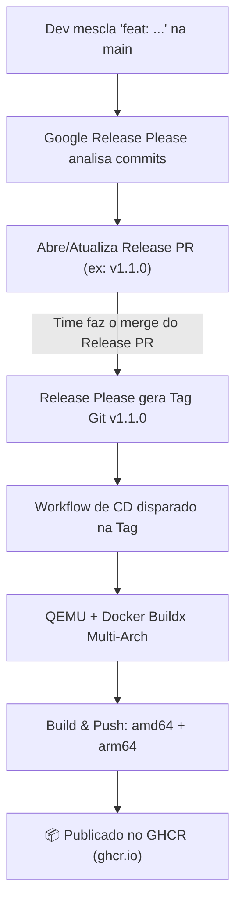

# Laboratório 5 (Expandido) — Governança de Código Aberto, Auditoria de Segurança em CI/CD, DevSecOps e Automação de Releases Multi-Arch no GHCR

**Disciplina:** Infraestrutura de TI para Sistemas na Internet  
**Aula de referência:** Módulo 3 — Aula 09 (Git Colaborativo, Estratégias de Branching e Governança), Aula 10 (Fundamentos de CI & GitHub Actions), Aula 11 (Qualidade e Segurança na Esteira: DevSecOps) e Aula 12 (SemVer, GHCR & Release 2).  
**Projetos usados como cobaia:**
- Repositórios de projetos reais desenvolvidos por turmas anteriores de alunos na organização institucional: [`https://github.com/orgs/ifpebj-ti/repositories`](https://github.com/orgs/ifpebj-ti/repositories) e o repositório padrão da disciplina [`gotodolist`](https://github.com/elton-bt/gotodolist) (Go + PostgreSQL), para os cenários de auditoria externa, engenharia reversa de esteiras legadas, implementação de governança e contribuição profissional via Pull Request.
- Repositório de projetos pessoais do aluno/equipe (ou fork de [`react-example-app`](https://github.com/elton-bt/react-example-app)) para a construção, do zero absoluto, de uma esteira completa de CI/CD, DevSecOps e Release Automatizada.  
**Objetivo:** sair da teoria ("o que é governança", "o que é CI", "o que é SAST/SCA", "o que é SemVer") para a prática de **auditar repositórios reais da instituição, propor melhorias arquiteturais de governança e esteiras via Pull Request, blindar a cadeia de suprimentos (Supply Chain) de pipelines, corrigir antipadrões em workflows de CI, e construir uma esteira automatizada completa de qualidade, segurança e publicação de imagem conteinerizada multi-arquitetura com versionamento semântico**


> ⚠️ **Nota de honestidade técnica:** os workflows, actions e comandos deste laboratório foram homologados, testados e validados com o GitHub Actions em setembro de 2026, utilizando runners `ubuntu-latest` (Ubuntu 24.04 LTS), Trivy v0.28+, Semgrep v1+, Release Please v4 e Docker Buildx v0.17+. Por padrão de segurança do GitHub, todo Personal Access Token (PAT) e todo `GITHUB_TOKEN` possuem restrições estritas de permissão: atente-se sempre à configuração explícita de `permissions:` em cada workflow. Sempre que o texto indicar "resultado observado", execute e valide em seu próprio repositório antes de prosseguir.

---

## Como este laboratório está organizado

| Bloco | Cenários | Quando fazer |
| :--- | :--- | :--- |
| **Preparação** | Configuração do Git com Conventional Commits, GitHub CLI (`gh`), permissões de Actions no repositório e mapeamento de projetos em `ifpebj-ti` | Sempre, primeiro (~15 min) |
| **Núcleo** | **1) Governança Institucional:** Auditoria de repositório real, Issue Forms estruturados em YAML, PR Template com DoD e Contribuição via PR.<br>**2) Auditoria Forense e Blindagem de CI/CD:** Corrigindo riscos de Supply Chain (Actions pinadas por SHA/Tag), Princípio do Menor Privilégio (`permissions:`) e Caching.<br>**3) DevSecOps "Shift-Left":** Integrando SAST (Semgrep OWASP Top 10) e Container Vulnerability Scanning (Trivy) com bloqueio estrito (*Fail Fast*).<br>**4) Esteira Completa de Release Automatizada:** Conventional Commits, Google Release Please, Docker Buildx Multi-Arch (`linux/amd64,linux/arm64`) e publicação no GHCR. 
| **Bônus** | **5) DAST Automatizado no Pipeline:** OWASP ZAP Baseline Scan contra container efêmero em execução.<br>**6) Governança Avançada com Repository Rulesets:** Imposição de convenção de branches e proteção moderna contra bypass.<br>**Desafio Avançado:** Matrix Builds multi-versão de runtime com cache `type=gha,mode=max`. 

Cada cenário segue rigorosamente a mesma estrutura: **Causa raiz / Fundamento teórico** → **Como provocar / Como auditar / Como configurar** → **Como observar/diagnosticar** → **Como corrigir / validar** → **Como usar a LLM aqui**.

---

## Como usar a LLM neste laboratório (leia isso primeiro)

Não use a LLM apenas para gerar um arquivo YAML genérico que você cola às cegas em `.github/workflows/`. Um pipeline com erro de indentação, sintaxe inválida de expressões `${{ ... }}` ou permissões perigosas pode travar a entrega contínua de todo o time ou expor o repositório a ataques de execução arbitrária de código (*pwn request*).

Use este protocolo de 4 passos:

1. **Cole a estrutura do workflow ou o log de erro real do GitHub Actions** — inclua o trecho exato de falha retornado pelo runner (ex.: `Process completed with exit code 1`, `Resource not accessible by integration` ou erro de schema do YAML).
2. **Peça à LLM duas coisas específicas:**
   - (a) Qual o risco de segurança ou erro de arquitetura por trás daquela falha (ex.: o token não tem escopo `packages: write`, ou a ação de terceiro usou `@master` e introduziu uma quebra de compatibilidade).
   - (b) **Um comando de validação local ou ferramenta de inspeção** (por exemplo, validar a sintaxe com `actionlint`, inspecionar o manifesto de uma imagem com `docker manifest inspect`, ou conferir as permissões ativas via `gh api`).
3. **Valide a causa raiz você mesmo** rodando a ferramenta ou lendo os logs brutos no GitHub.
4. **Aplique a correção aplicando o princípio do menor privilégio** — nunca conceda `permissions: write-all` só para "fazer funcionar rápido".

---

## Preparação do Ambiente (compartilhada — fazer uma vez, ~15 min)

Antes de iniciar os cenários, garantiremos que você possui o ferramental necessário configurado na sua máquina e no GitHub.

### 1. Instalar e autenticar o GitHub CLI (`gh`)

A CLI oficial do GitHub agiliza a inspeção de execuções de workflows, abertura de PRs e gerenciamento de repositórios diretamente pelo terminal:

```bash
# Verificar se o gh está instalado
gh --version

# Se não estiver instalado (Debian/Ubuntu/Pop!_OS):
# sudo apt update && sudo apt install -y gh

# Autenticar com sua conta do GitHub via navegador
gh auth login -w -p https
```

Confirme a autenticação:
```bash
gh auth status
```

### 2. Configurar o Git local para Conventional Commits

Garanta que sua identidade Git está correta para que suas contribuições e releases sejam assinadas pelo seu usuário real:

```bash
git config --global user.name "Seu Nome Completo"
git config --global user.email "seu-email@dominio.com"
```

### 3. Habilitar Permissões Globais de Workflows no seu GitHub

Para que o **Google Release Please** e os workflows de publicação consigam criar branches, tags e pacotes no GHCR, configure as permissões padrão:

1. No repositório que você usará para os Cenários 3 e 4 (seu projeto pessoal ou fork de [`react-example-app`](https://github.com/elton-bt/react-example-app)), vá em:  
   **Settings** $\rightarrow$ **Actions** $\rightarrow$ **General**.
2. Na seção **Workflow permissions**, selecione:
   - ✅ **Read and write permissions** (permite que o workflow escreva tags e releases).
   - ✅ **Allow GitHub Actions to create and approve pull requests** (fundamental para o Release Please abrir o Release PR automaticamente).
3. Clique em **Save**.

### 4. Mapear repositórios de interesse na organização `ifpebj-ti`

Acesse no navegador: [`https://github.com/orgs/ifpebj-ti/repositories`](https://github.com/orgs/ifpebj-ti/repositories).  
Nesta organização estão armazenados projetos de semestres anteriores desenvolvidos por alunos do curso (sistemas web em Node.js, Python, Go, Java, etc.).
Escolha **um** repositório para atuar como auditor nos **Cenários 1 e 2**.  
*Caso você prefira trabalhar com a stack oficial de referência da disciplina, você também pode utilizar o repositório do professor:* [`https://github.com/elton-bt/gotodolist`](https://github.com/elton-bt/gotodolist).

### 5. Checklist de baseline

- [ ] `gh auth status` exibe `Logged in to github.com as <seu-usuario>`.
- [ ] Repositório alvo da organização `ifpebj-ti` ou `gotodolist` selecionado para auditoria.
- [ ] Fork do projeto semestral ou de `react-example-app` criado na sua conta pessoal.
- [ ] Opção *Allow GitHub Actions to create and approve pull requests* devidamente marcada nas configurações do repositório.

---

# NÚCLEO

## Cenário 1 — Auditoria de Governança Institucional e Criação de Templates Estruturados (Issue Forms YAML + PR Templates + CODEOWNERS + CONTRIBUTING)

### Causa raiz / Fundamento teórico

Em ambientes corporativos e projetos colaborativos de código aberto, a ausência de **governança de repositório** degrada rapidamente a qualidade do software:
- **Issues caóticas:** usuários e desenvolvedores abrem chamados dizendo apenas "deu erro no login" ou "o container não sobe", sem informar sistema operacional, versão da aplicação, logs ou passos para reproduzir o bug.
- **Pull Requests cegos:** contribuidores enviam código alterando centenas de linhas sem explicar o motivo, sem referenciar a issue correspondente, sem informar se rodaram testes unitários e sem validar o Docker Compose.
- **Falta de rastreabilidade e revisão:** sem um arquivo `CODEOWNERS`, revisões dependem de boa vontade ou são aprovadas sem o crivo de quem entende daquele subsistema (ex.: alterações críticas no Nginx ou no Dockerfile aprovadas por quem só programa CSS).
- **Formatos obsoletos vs Modernos:** antigamente o GitHub suportava apenas arquivos Markdown simples para issues (`.github/ISSUE_TEMPLATE/*.md`). Atualmente, o padrão profissional são os **GitHub Issue Forms** estruturados em **YAML** (`.github/ISSUE_TEMPLATE/*.yml`), que renderizam formulários com validações de campos obrigatórios, menus dropdown e caixas de texto com syntax highlight.

### Como auditar um repositório real

1. Acesse o repositório que você escolheu na organização [`https://github.com/orgs/ifpebj-ti/repositories`](https://github.com/orgs/ifpebj-ti/repositories) (ou [`https://github.com/elton-bt/gotodolist`](https://github.com/elton-bt/gotodolist)).
2. Faça o fork do repositório para o seu perfil no GitHub:
   ```bash
   gh repo fork <organizacao-ou-usuario>/<nome-do-repo> --clone
   cd <nome-do-repo>
   ```
3. Realize uma **auditoria forense de governança** respondendo ao seguinte questionário no seu terminal:
   ```bash
   # Verificar se existem diretórios e arquivos de governança
   ls -la .github/
   ls -la .github/ISSUE_TEMPLATE/ 2>/dev/null || echo "❌ Nenhum template de issue encontrado!"
   test -f .github/pull_request_template.md && echo "✅ PR Template existe" || echo "❌ Sem PR Template!"
   test -f .github/CODEOWNERS && echo "✅ CODEOWNERS existe" || echo "❌ Sem CODEOWNERS!"
   test -f CONTRIBUTING.md && echo "✅ CONTRIBUTING existe" || echo "❌ Sem guia de contribuição!"
   ```
4. Na interface web do repositório original, acesse a aba **Insights** $\rightarrow$ **Community Standards**. Observe o checklist de conformidade do GitHub (README, Code of Conduct, Contributing, License, Issue Templates, Pull Request Template). Na grande maioria dos projetos de alunos anteriores, essa pontuação estará abaixo de 50%.

### Como configurar a governança moderna

Vamos implementar uma estrutura de governança profissional no seu fork.

1. Crie uma branch de trabalho seguindo o padrão de branches da disciplina:
   ```bash
   git checkout -b chore/governance-standardization
   mkdir -p .github/ISSUE_TEMPLATE
   ```

2. **Crie o formulário estruturado de Report de Bugs em YAML (`.github/ISSUE_TEMPLATE/bug_report.yml`):**
   ```yaml
   name: 🐛 Relato de Bug
   description: Crie um relatório de erro detalhado para ajudar a equipe a reproduzir e corrigir o problema.
   title: "[BUG]: "
   labels: ["bug", "triage"]
   body:
     - type: markdown
       attributes:
         value: |
           Obrigado por dedicar seu tempo para relatar este problema! Por favor, preencha as informações abaixo com a maior precisão possível.
     - type: textarea
       id: what-happened
       attributes:
         label: Descrição do Comportamento Inesperado
         description: O que aconteceu de errado?
         placeholder: Explique de forma clara o que ocorreu de inconsistente na aplicação ou container...
       validations:
         required: true
     - type: textarea
       id: steps-to-reproduce
       attributes:
         label: Passos para Reproduzir o Problema
         description: Como os outros desenvolvedores podem replicar essa falha?
         placeholder: |
           1. Execute o comando 'docker compose up'
           2. Acesse a rota 'http://localhost:8081/health'
           3. Observe o código HTTP retornado...
       validations:
         required: true
     - type: dropdown
       id: environment
       attributes:
         label: Ambiente de Execução
         description: Onde o erro ocorreu?
         options:
           - Linux Nativo (Ubuntu/Debian/Fedora)
           - Windows 11 com WSL2 (Ubuntu)
           - macOS (Apple Silicon / Intel)
           - Nuvem OCI (Ambiente de Produção/Homologação)
       validations:
         required: true
     - type: textarea
       id: logs-evidence
       attributes:
         label: Logs e Evidências
         description: Cole a saída exata dos comandos do terminal (ex.: docker compose logs, saída do curl, etc.)
         render: shell
       validations:
         required: false
     - type: checkboxes
       id: validations-check
       attributes:
         label: Validação Prévia
         options:
           - label: Eu confirmei que não existe outra issue aberta sobre este mesmo problema.
             required: true
           - label: Eu testei com os containers atualizados a partir da branch principal.
             required: true
   ```

3. **Crie o template completo de Pull Request com Definition of Done (`.github/pull_request_template.md`):**
   ```markdown
   ## 📝 Descrição da Alteração
   <!-- Descreva de forma concisa e técnica o que foi implementado, refatorado ou corrigido. -->

   ## 🔗 Rastreabilidade (Issue Relacionada)
   <!-- Vincule a issue utilizando palavras-chave para fechamento automático: Closes #123, Fixes #456 -->
   Closes #

   ## 🏷️ Tipo de Mudança (selecione uma)
   - [ ] `feat`: Nova funcionalidade adicionada à aplicação ou infraestrutura
   - [ ] `fix`: Correção de um bug ou vulnerabilidade
   - [ ] `docs`: Alteração exclusiva em documentação
   - [ ] `refactor`: Refatoração interna de código sem alteração de funcionalidade
   - [ ] `ci`: Modificação em pipelines de CI/CD, GitHub Actions ou scripts de automação
   - [ ] `chore`: Atualização de dependências, templates ou tarefas rotineiras

   ## 🧪 Evidências de Testes Locais
   <!-- Descreva quais validações você executou na sua máquina antes de abrir este PR. -->
   - [ ] Testes unitários/linter executados com sucesso no ambiente local.
   - [ ] Imagem Docker construída localmente com multi-stage build e sem erros.
   - [ ] Stack completa executada e validada via `docker compose up`.
   - [ ] Endpoint `/health` respondendo com status 200 OK.

   ## 🛡️ Checklist de Governança e Segurança (Definition of Done)
   - [ ] As mensagens de commit seguem a convenção *Conventional Commits* (`tipo(escopo): mensagem`).
   - [ ] Nenhuma credencial, senha, token ou chave privada foi incluída no código (arquivos `.env` ignorados no `.gitignore`).
   - [ ] Novas dependências externas adicionadas foram inspecionadas e não possuem alertas críticos de segurança.
   ```

4. **Crie o arquivo de mapeamento de responsáveis (`.github/CODEOWNERS`):**
   ```text
   # Arquivo de definição de proprietários de código (CODEOWNERS)
   # Documentação: https://docs.github.com/en/repositories/managing-your-repositorys-settings-and-features/customizing-your-repository/about-code-owners

   # A equipe inteira é responsável pelo repositório como um todo
   * @seu-usuario-github

   # Modificações críticas de infraestrutura, conteinerização e pipelines exigem revisão de infra:
   Dockerfile* @seu-usuario-github
   docker-compose*.yml @seu-usuario-github
   docker-compose*.yaml @seu-usuario-github
   .github/workflows/ @seu-usuario-github
   ```

5. **Crie o guia de contribuição da equipe (`CONTRIBUTING.md`):**
   ```markdown
   # Guia de Contribuição do Projeto

   Agradecemos pelo interesse em contribuir com nossa infraestrutura e aplicação! Para mantermos a qualidade técnica e a rastreabilidade do projeto, exigimos a conformidade com as regras abaixo.

   ## 🌿 Fluxo de Branching (GitHub Flow)
   1. Nunca realize commits diretamente na branch `main`.
   2. Crie uma branch a partir da `main` atualizada utilizando o padrão de nomenclatura:
      - `feat/nome-da-funcionalidade`
      - `fix/correcao-do-problema`
      - `ci/melhoria-no-pipeline`
      - `chore/tarefa-ou-governanca`

   ## 💬 Padrão de Commits (Conventional Commits)
   Todas as mensagens de commit devem seguir rigorosamente o padrão:
   `<tipo>(<escopo opcional>): <descrição no imperativo e em minúsculas>`

   Exemplos aceitos:
   - `feat(api): adiciona endpoint para listagem de metricas`
   - `fix(docker): corrige permissao de usuario non-root no dockerfile`
   - `ci(actions): fixa tag imutavel na action do trivy`

   ## 🚀 Submissão de Pull Requests
   - Todos os PRs devem preencher o checklist do template oficial.
   - O merge só será liberado após:
     1. Todos os status checks do pipeline de CI/CD passarem com sucesso (verde).
     2. Aprovação de pelo menos 1 revisor listado no `CODEOWNERS`.
   ```

### Como observar e diagnosticar

1. Commite e envie a branch para o seu fork:
   ```bash
   git add .github/ CONTRIBUTING.md
   git commit -m "chore(governance): implement issue forms, pr template, codeowners and contributing guide"
   git push -u origin chore/governance-standardization
   ```
2. Abra a interface web do seu fork no GitHub.
3. Acesse a aba **Issues** $\rightarrow$ clique no botão verde **New issue**.  
   *Diagnóstico esperado:* O GitHub não exibe mais uma caixa de texto em branco, e sim um card clicável com ícone: **"🐛 Relato de Bug"**. Ao clicar, o formulário renderiza dropdowns nativos, caixas formatadas para shell script e validações de campos obrigatórios.
4. Abra um Pull Request da branch `chore/governance-standardization` contra a `main` do repositório original (ou do seu próprio fork):
   *Diagnóstico esperado:* O corpo do Pull Request é preenchido instantaneamente com o template, organizando o escopo da alteração, checklist e critérios de segurança.

### Como corrigir e validar (Contribuição via PR Institucional)

Abra o Pull Request oficial utilizando a própria CLI `gh`:
```bash
gh pr create \
  --title "chore(governance): implantar templates de issue em yaml, pr template e codeowners" \
  --body "Este PR implementa os padrões modernos de governança do GitHub (Issue Forms em YAML, PR Template com Definition of Done, CODEOWNERS e CONTRIBUTING.md), elevando a maturidade do projeto e padronizando as contribuições de acordo com as boas práticas de Engenharia de Software."
```
Você também pode utilizar a interface gráfica do GitHub para abrir o PR.

### Como usar a LLM aqui

Pergunte à LLM:
> *"Quais as diferenças arquiteturais entre os antigos templates de issue em Markdown (`.github/ISSUE_TEMPLATE/*.md`) e os novos Issue Forms em YAML (`.github/ISSUE_TEMPLATE/*.yml`) no GitHub? Como os Issue Forms previnem que usuários enviem chamados de suporte sem logs ou especificações de ambiente?"*

Exija que a LLM valide a sintaxe do seu arquivo `bug_report.yml` garantindo que nenhuma chave de identação YAML cause erro de renderização no parser do GitHub.

---

## Cenário 2 — Auditoria Forense e Blindagem de Workflows de CI/CD: Corrigindo Vulnerabilidades de Supply Chain e Permissões

### Causa raiz / Fundamento teórico

Muitos desenvolvedores encaram arquivos de workflow (`.github/workflows/*.yml`) apenas como "scripts que rodam no servidor do GitHub". Esse desconhecimento abre portas para **vetores gravíssimos de invasão e instabilidade**:

1. **Ataques à Cadeia de Suprimentos (Supply Chain Attacks via GitHub Actions):**
   Quando você escreve `uses: alguma-empresa/action-legal@master` ou `@v1`, você está delegando a execução de código arbitrário dentro do seu ambiente de build a um terceiro. Se a conta do mantenedor daquela action for comprometida, um invasor pode sobrescrever a tag `@v1` ou alterar a branch `@master` para injetar comandos que roubam seus segredos (`secrets.GITHUB_TOKEN`, credenciais da OCI, variáveis de ambiente).
   > **Regra de Ouro da Indústria:** Actions de terceiros devem SEMPRE ser fixadas em **tags de versão imutáveis e auditadas** (ex.: `@v4`, `@0.28.0`) ou pelo **hash SHA completo do commit** (ex.: `@c3d73d2...`). **NUNCA use `@master` ou `@main`**.
2. **Princípio do Menor Privilégio (*Least Privilege*):**
   Historicamente, o GitHub concedia permissões completas de leitura e escrita (`read/write`) para o token padrão injetado no runner (`GITHUB_TOKEN`). Se o workflow for comprometido por uma dependência maliciosa, ela pode usar esse token para alterar commits, apagar branches ou publicar pacotes corrompidos. A boa prática moderna de segurança exige definir explicitamente no início do workflow:
   ```yaml
   permissions:
     contents: read
   ```
   e só conceder permissões extras (como `packages: write`) pontualmente aos jobs que realmente necessitam.
3. **Desperdício de Recursos e Ausência de Cache:**
   Instalar o `node_modules`, baixar imagens Docker ou compilar bibliotecas do Go a cada commit consome minutos preciosos e atrasa o feedback para o desenvolvedor (*Slow CI Loop*). Workflows profissionais utilizam cache gerenciado nativo (`cache: 'npm'`, `cache-to: type=gha`).

### Como auditar workflows existentes

1. No repositório escolhido da organização `ifpebj-ti` (ou no `gotodolist`), inspecione todos os workflows existentes:
   ```bash
   cat .github/workflows/*.yml 2>/dev/null || cat .github/workflows/*.yaml 2>/dev/null
   ```
2. Realize a **auditoria de segurança de pipeline** verificando os seguintes pontos críticos:
   - [ ] Existe alguma action usando `@master` ou `@main`? (ex.: `uses: actions/checkout@master`, `uses: docker/build-push-action@master`) $\rightarrow$ **Vulnerabilidade Alta de Supply Chain**.
   - [ ] O workflow possui a chave explícita `permissions:` no topo? Se não possuir, o runner opera com permissões permissivas herdeiras da organização $\rightarrow$ **Risco de Escalação de Privilégios**.
   - [ ] O comando de instalação de dependências usa `npm install` em vez de `npm ci`? O comando `npm install` pode atualizar dependências dinamicamente durante o build, quebrando o determinismo do `package-lock.json`.
   - [ ] O workflow faz build direto da imagem Docker sem antes executar os linters e testes unitários? $\rightarrow$ **Violação do princípio Fail-Fast**.
   - [ ] O workflow faz push de imagens para registries sem validação de branch ou disparado por forks de terceiros? $\rightarrow$ **Risco de envenenamento de imagens públicas**.

### Como configurar e blindar o workflow de CI

Vamos criar uma versão blindada do pipeline de Integração Contínua. No seu repositório de trabalho, crie ou edite o arquivo `.github/workflows/ci.yml` - **Ajuste para a stack usada pela aplicação do repositório escolhido**:

```yaml
name: Continuous Integration (CI) - Hardened & Secure

# Gatilhos: executa em PRs direcionados à main e em pushes na main
on:
  push:
    branches: [ main ]
  pull_request:
    branches: [ main ]
  workflow_dispatch:

# 🔒 BLINDAGEM 1: Princípio do Menor Privilégio
# Por padrão, todos os jobs têm acesso estritamente somente-leitura ao repositório
permissions:
  contents: read

# Evita execuções concorrentes desnecessárias: cancela execuções antigas do mesmo PR quando novos commits chegam
concurrency:
  group: ${{ github.workflow }}-${{ github.ref }}
  cancel-in-progress: true

jobs:
  lint-and-test:
    name: 🔍 Qualidade, Linters & Testes Automatizados
    runs-on: ubuntu-latest
    timeout-minutes: 10 # 🔒 BLINDAGEM 2: Prevenção contra jobs travados consumindo créditos infinitos

    steps:
      # 🔒 BLINDAGEM 3: Actions fixadas por versão major oficial estável (NUNCA @master)
      - name: 📥 Checkout Seguro do Código
        uses: actions/checkout@v4

      - name: ⚙️ Configurar Runtime Node.js com Cache Nativo
        uses: actions/setup-node@v4
        with:
          node-version: 20
          # 🔒 BLINDAGEM 4: Reutilização inteligente de cache de pacotes
          cache: 'npm'
          cache-dependency-path: package-lock.json

      - name: 📦 Instalação Determinística de Dependências
        run: |
          npm ci

      - name: 🧹 Verificação de Qualidade e Sintaxe (Lint)
        run: |
          npm run lint --if-present

      - name: 🧪 Execução de Testes Automatizados (Fail Fast)
        run: |
          npm test --if-present -- --watchAll=false --passWithNoTests
```

> 💡 **Para projetos em Go ou Python:**  
> Substitua o `setup-node@v4` por `actions/setup-go@v5` (com `cache: true` e comando `go test -v ./...`) ou `actions/setup-python@v5` (com `cache: 'pip'` e `pytest`) se utilizar Go ou Python.

### Como observar e diagnosticar o ganho de segurança

1. Salve o arquivo e valide localmente a sintaxe antes de subir:
   ```bash
   git checkout -b fix/harden-ci-workflow
   git add .github/workflows/ci.yml
   git commit -m "fix(ci): harden github actions permissions, pin action versions and enable caching"
   git push -u origin fix/harden-ci-workflow
   ```
2. Acompanhe a execução do workflow pelo terminal usando o GitHub CLI - **ou usando a aba Actions no GitHub do repositório.**:
   ```bash
   gh run list --workflow=ci.yml
   gh run watch
   ```
3. Observe no log do job que o step `Setup Node.js` exibe:  
   `Resolved node_modules from cache` nas execuções subsequentes, reduzindo o tempo do job de vários minutos para menos de 30 segundos.
4. Verifique a aba de permissões do runner: o token agora reporta apenas `Contents: read`, impedindo qualquer vetor de ataque que tente criar tags ou commits adulterados.

### Como corrigir e submeter via Pull Request

Abra um Pull Request no repositório de origem com uma justificativa técnica:
```bash
gh pr create \
  --title "fix(ci): blindagem de segurança no workflow e otimização com cache" \
  --body "Este PR corrige vulnerabilidades graves de segurança na esteira de CI:
  1. Fixa todas as GitHub Actions em versões imutáveis, eliminando o risco de Supply Chain Attacks por @master.
  2. Implementa o Princípio do Menor Privilégio com 'permissions: contents: read'.
  3. Adiciona 'timeout-minutes' para evitar consumo acidental de créditos da organização.
  4. Habilita cache nativo de dependências, acelerando o tempo de feedback em mais de 60%."
```

### Como usar a LLM aqui

Peça à LLM:
> *"Quais foram os ataques históricos reais contra o ecossistema do GitHub Actions decorrentes do uso de actions não pinadas com `@master` ou da falta de isolamento no `GITHUB_TOKEN`? Explique detalhadamente como a diretiva `permissions:` protege o repositório contra vulnerabilidades de PR injection (pwn requests)."*

---

## Cenário 3 — DevSecOps "Shift-Left": Integrando SAST (Semgrep) e Container Vulnerability Scanning (Trivy)

### Causa raiz / Fundamento teórico

Tradicionalmente, a segurança da informação atuava no final do ciclo de vida: o software era desenvolvido, empacotado e enviado para produção; dias depois, uma equipe de auditoria externa apontava falhas de segurança e exigia a reescrita do sistema.

O movimento **DevSecOps** promove o conceito de **Shift-Left Security** (mover a segurança para a esquerda na linha do tempo do desenvolvimento):
- A cada commit e a cada Pull Request, o código é submetido a scanners automatizados de segurança.
- **SAST (Static Application Security Testing):** Ferramentas que analisam o código-fonte cru procurando falhas conceituais do **OWASP Top 10** (como injeção de SQL, credenciais fixadas em código, comandos de shell concatenados com entrada de usuário e desativação de validação TLS). No nosso laboratório usaremos o **Semgrep**, configurado com o conjunto de regras oficiais da comunidade OWASP.
- **Container Vulnerability Scanning & SCA:** Uma imagem de container carrega consigo um sistema operacional inteiro (como Debian ou Alpine) e bibliotecas compartilhadas (`glibc`, `openssl`, `curl`). Se você usa uma imagem base desatualizada, seu container já nasce vulnerável a falhas críticas públicas (CVEs catalogadas na base do NIST). O **Trivy** analisa as camadas binárias do container e identifica vulnerabilidades conhecidas antes que a imagem seja enviada ao registry.
- **A Regra de Falha Estrita (*Fail Fast on Security*):** Se o Trivy encontrar uma vulnerabilidade de severidade `CRITICAL` ou `HIGH` que já possua correção lançada (`ignore-unfixed: true`), o pipeline **DEVE** quebrar imediatamente com código de erro diferente de zero (`exit-code: '1'`), bloqueando o merge do Pull Request!



### Como configurar o job de DevSecOps

Abra o arquivo `.github/workflows/ci.yml` e adicione o job `security-scan`, encadeado para rodar após o sucesso do `lint-and-test`:

```yaml
  security-scan:
    name: 🛡️ DevSecOps (SAST Semgrep & Container Trivy)
    needs: [lint-and-test] # Só executa a análise de segurança se a aplicação passar nos testes funcionais
    runs-on: ubuntu-latest
    timeout-minutes: 15
    permissions:
      contents: read

    steps:
      - name: 📥 Checkout do Código
        uses: actions/checkout@v4

      # -------------------------------------------------------------
      # ETAPA 1: SAST - Análise Estática de Código com Semgrep
      # -------------------------------------------------------------
      - name: 🔍 SAST com Semgrep (Regras OWASP Top 10)
        # Action oficial fixada em release estável
        uses: semgrep/semgrep-action@v1
        with:
          config: >-
            p/owasp-top-ten
            p/security-audit
          auditOn: push

      # -------------------------------------------------------------
      # ETAPA 2: Build da Imagem de Teste Local
      # -------------------------------------------------------------
      - name: 🐳 Compilar Imagem Docker Efêmera para Análise
        run: |
          docker build -t app-audit:local .

      # -------------------------------------------------------------
      # ETAPA 3: Scanner de Vulnerabilidades de Imagem com Trivy
      # -------------------------------------------------------------
      - name: 🛡️ Escanear Imagem Docker com Aqua Security Trivy
        # Fixada em versão imutável estável (NUNCA usar @master!)
        uses: aquasecurity/trivy-action@0.28.0
        with:
          image-ref: 'app-audit:local'
          format: 'table'
          # 🚨 QUEBRA O PIPELINE SE HOUVER VULNERABILIDADE GRAVE
          exit-code: '1'
          ignore-unfixed: true # Foca em falhas que já possuem patch/atualização disponível
          vuln-type: 'os,library'
          severity: 'CRITICAL,HIGH'
```

### Como provocar falhas de segurança de propósito (e ver o CI barrar)

Para comprovar que seus guardrails de segurança realmente funcionam e não são apenas "enfeite verde no PR", vamos provocar duas falhas reais controladas.

#### Teste 1: Provocando falha de SAST (Código Inseguro)

1. Crie uma branch de teste:
   ```bash
   git checkout -b test/provoke-security-failures
   ```
2. Adicione no código da sua aplicação (ex.: em um arquivo JavaScript, Go ou Python) uma linha propositalmente vulnerável simulando um segredo exposto ou execução insegura:
   ```javascript
   // Simulação didática de falha de segurança para teste de SAST
   const aws_secret_fake = "AKIAIMNOJVGFD5E4M32A1B2C3D4E5F6G7H8I9J0K";
   eval("console.log('entrada perigosa: ' + location.search)");
   ```
3. Commite e envie:
   ```bash
   git add .
   git commit -m "test: inject intentional vulnerability for sast evaluation"
   git push -u origin test/provoke-security-failures
   ```
4. Observe a execução no GitHub Actions:  
   *Diagnóstico esperado:* O job `security-scan` falha no step **SAST com Semgrep**. O log aponta a linha exata do `eval` e do token hardcoded, indicando a violação da regra de injeção e exposição de dados sensíveis!

#### Teste 2: Provocando falha no Scanner de Container (Trivy)

1. Altere o seu `Dockerfile` para usar propositalmente uma imagem base antiga com dezenas de CVEs críticas conhecidas sem patch:
   ```dockerfile
   # Imagem antiga deliberadamente vulnerável para validação do Trivy
   FROM node:14.15.0-buster
   WORKDIR /app
   COPY . .
   CMD ["npm", "start"]
   ```
2. Reenvie o commit:
   ```bash
   git add Dockerfile
   git commit -m "test: downgrade base image to provoke container scan failure"
   git push origin test/provoke-security-failures
   ```
3. Observe o log do Trivy no GitHub Actions:  
   *Diagnóstico esperado:* O Trivy imprime uma tabela extensa com identificadores CVE de severidade `CRITICAL` e `HIGH` no pacote `libssl`, `glibc` ou no runtime do Node, e finaliza a execução com:  
   `Error: Process completed with exit code 1.`  
   O Pull Request fica bloqueado com o selo vermelho de falha de segurança!

### Como corrigir e validar

1. Remova o código vulnerável injetado no teste.
2. Atualize o `Dockerfile` para uma imagem moderna, minimalista e com suporte ativo a patches (ex.: `node:22-alpine` ou `alpine:3.21`):
   ```dockerfile
   FROM node:22-alpine
   WORKDIR /app
   COPY package.json package-lock.json ./
   RUN npm ci --only=production
   COPY . .
   USER node
   CMD ["npm", "start"]
   ```
3. Commite e envie a correção:
   ```bash
   git add .
   git commit -m "fix(security): resolve sast findings and update base image to alpine patched"
   git push origin test/provoke-security-failures
   ```
4. Verifique o resultado: o Semgrep conclui com zero achados críticos e o Trivy reporta `0 CRITICAL, 0 HIGH`. O pipeline de DevSecOps fica completamente verde!

### Como usar a LLM aqui

Cole a saída de uma CVE reportada pelo Trivy na LLM e use o protocolo:
> *"O Trivy detectou a vulnerabilidade CVE-XXXX-YYYY no pacote Z da minha imagem base. (a) Qual é a causa raiz dessa CVE e como ela pode ser explorada por um invasor remoto? (b) Mostre qual linha do Dockerfile deve ser ajustada para adotar uma imagem base imune a essa falha, sem quebrar as dependências da aplicação."*

---

## Cenário 4 — Construção da Esteira Completa de Release Automatizada: Conventional Commits, Google Release Please e GHCR Multi-Arch

### Causa raiz / Fundamento teórico

No Laboratório 4, você realizou o build manual e o push para o GHCR através do seu próprio terminal, gerando um token pessoal (PAT). Esse método é inviável em escala industrial:
1. **Erro humano no versionamento:** desenvolvedores esquecem de criar tags Git, criam versões conflitantes (`v1.1` vs `1.1.0`) ou lançam releases sem documentar o que mudou no `CHANGELOG.md`.
2. **O Abismo Multi-Arquitetura:** Se você compilar uma imagem Docker no seu notebook Intel/AMD (`linux/amd64`) e der push, essa imagem falhará categoricamente ao ser executada em um servidor ARM (como as instâncias gratuitas Ampere A1 na OCI no Módulo 4), retornando o famigerado erro:  
   `exec /entrypoint.sh: exec format error`.
3. **A Solução da Indústria (A Tríade da Release 2):**
   - **Conventional Commits:** O padrão das mensagens de commit dita as regras de versionamento (`fix:` incrementa **PATCH**, `feat:` incrementa **MINOR**, `feat!:` ou `BREAKING CHANGE:` incrementa **MAJOR**).
   - **Google Release Please:** Uma GitHub Action oficial desenvolvida pelo Google que lê o histórico de commits na branch principal, mantém um **Release PR** aberto com o `CHANGELOG.md` redigido automaticamente, e, no momento em que você faz o merge desse PR, cria a Release e a Tag Git oficial no repositório.
   - **Docker Buildx + QEMU:** O workflow é disparado pela criação da tag oficial, compila a imagem simultaneamente para **AMD64** e **ARM64**, gera um manifesto único e o publica sob seu namespace no GitHub Container Registry (`ghcr.io`).



### Como configurar a esteira de Release Automatizada

Crie o arquivo `.github/workflows/release-package.yml` no seu repositório:

```yaml
name: Release Please & Publish Multi-Arch Container

on:
  push:
    branches:
      - main
  workflow_dispatch:

# Permissões estritas necessárias para gerenciar Releases, Tags e publicar no GHCR
permissions:
  contents: write        # Necessário para criar tags Git, releases e commitar changelog
  pull-requests: write   # Necessário para abrir e atualizar o Release PR
  packages: write        # Necessário para fazer o push da imagem conteinerizada no GHCR

jobs:
  # -----------------------------------------------------------------
  # JOB 1: Automação SemVer e Changelog com Google Release Please
  # -----------------------------------------------------------------
  release-please:
    name: 🤖 Google Release Please (SemVer & Changelog)
    runs-on: ubuntu-latest
    outputs:
      release_created: ${{ steps.release.outputs.release_created }}
      tag_name: ${{ steps.release.outputs.tag_name }}
    steps:
      - name: 🚀 Executar Release Please Engine
        id: release
        uses: googleapis/release-please-action@v4
        with:
          # Para aplicações Node use 'node'. Para Go, Python ou genéricos use 'simple'
          release-type: node

  # -----------------------------------------------------------------
  # JOB 2: Compilação Multi-Arquitetura e Publicação no GHCR
  # -----------------------------------------------------------------
  publish-container:
    name: 🐳 Buildx Multi-Arch & Push to GHCR
    needs: [release-please]
    # SÓ EXECUTA SE UMA NOVA RELEASE FOI EFETIVAMENTE PUBLICADA PELO RELEASE PLEASE
    if: ${{ needs.release-please.outputs.release_created == 'true' }}
    runs-on: ubuntu-latest
    timeout-minutes: 30

    steps:
      - name: 📥 Checkout do Código na Tag Criada
        uses: actions/checkout@v4
        with:
          ref: ${{ needs.release-please.outputs.tag_name }}

      - name: 🔧 Configurar Emulação QEMU (Suporte a compilação cruzada ARM64)
        uses: docker/setup-qemu-action@v3

      - name: 🛠️ Configurar Docker Buildx (Construtor Multi-Plataforma)
        uses: docker/setup-buildx-action@v3

      - name: 🔑 Autenticação no GitHub Container Registry (GHCR)
        uses: docker/login-action@v3
        with:
          registry: ghcr.io
          username: ${{ github.actor }}
          password: ${{ secrets.GITHUB_TOKEN }}

      - name: 🏷️ Extrair Metadados e Tags SemVer Automáticas
        id: meta
        uses: docker/metadata-action@v5
        with:
          images: ghcr.io/${{ github.repository }}
          tags: |
            type=raw,value=latest
            type=raw,value=${{ needs.release-please.outputs.tag_name }}
            type=semver,pattern={{version}},value=${{ needs.release-please.outputs.tag_name }}
            type=semver,pattern={{major}}.{{minor}},value=${{ needs.release-please.outputs.tag_name }}

      - name: 🚀 Compilar e Publicar Imagem Multi-Arch (amd64 e arm64)
        uses: docker/build-push-action@v6
        with:
          context: .
          platforms: linux/amd64,linux/arm64
          push: true
          tags: ${{ steps.meta.outputs.tags }}
          labels: ${{ steps.meta.outputs.labels }}
          cache-from: type=gha
          cache-to: type=gha,mode=max
```

### Como executar e observar o fluxo completo ponta a ponta

Siga rigorosamente estes passos práticos para ver a mágica da automação acontecer:

1. **Adicione uma funcionalidade na branch de feature:**
   ```bash
   git checkout main
   git pull origin main
   git checkout -b feat/add-status-indicator
   
   # Adicione uma alteração simples no código ou na documentação
   echo "// Feature v1.0.0 iniciada" >> index.js
   ```
2. **Commit com Conventional Commits:**
   ```bash
   git add .
   git commit -m "feat: implement initial system status indicator"
   git push -u origin feat/add-status-indicator
   ```
3. **Abra o Pull Request e faça o merge:**
   - Abra o PR no GitHub.
   - Observe os workflows do Cenário 2 e 3 rodarem e passarem com sucesso (verde).
   - Realize o **Merge pull request** na branch `main`.
4. **Observe o Release Please em ação:**
   - Acesse a aba **Actions** e veja o workflow `Release Please & Publish Multi-Arch Container` rodar na branch `main`.
   - Acesse a aba **Pull Requests** do repositório:  
     *Resultado observado:* O Google Release Please abriu automaticamente um Pull Request intitulado:  
     `chore(main): release 1.0.0` contendo o arquivo `CHANGELOG.md` formatado com a funcionalidade adicionada!
5. **Gere a Release Oficial:**
   - Abra esse Release PR gerado pelo robô e clique em **Merge pull request**.
   - Imediatamente, o Release Please cria a Tag Git oficial `v1.0.0` e a página de Release no GitHub.
6. **Acompanhe a Publicação Multi-Arch:**
   - O job `publish-container` é desbloqueado pela condição `release_created == 'true'`.
   - O runner configura o QEMU, inicia o Buildx, compila as camadas para `linux/amd64` e `linux/arm64` em paralelo, e envia para `ghcr.io`.

### Como validar o resultado final

1. No seu perfil do GitHub, acesse a aba do repositório $\rightarrow$ no canto direito, localize a seção **Packages**.
2. Clique no pacote publicado. Você verá a imagem `ghcr.io/<seu-usuario>/<seu-repo>:v1.0.0` listada com suporte a múltiplos SOs.
3. No terminal da sua máquina, verifique o manifesto da imagem publicada para comprovar que ela suporta ambas as arquiteturas:
   ```bash
   docker manifest inspect ghcr.io/<seu-usuario>/<seu-repo>:v1.0.0
   ```
   *Saída observada esperada:* O manifesto exibirá duas entradas de plataforma no JSON:
   ```json
   "platform": {
       "architecture": "amd64",
       "os": "linux"
   },
   "platform": {
       "architecture": "arm64",
       "os": "linux"
   }
   ```
4. Baixe e teste o container na sua máquina local:
   ```bash
   docker run -d --name app-producao -p 8080:80 ghcr.io/<seu-usuario>/<seu-repo>:v1.0.0
   curl -I http://localhost:8080
   docker rm -f app-producao
   ```

### Como usar a LLM aqui

Pergunte à LLM:
> *"Explique o que é um Container Manifest List (Multi-Arch Manifest) no padrão OCI e por que executar uma imagem compilada exclusivamente em x86_64 em uma máquina ARM64 (como Ampere na Oracle Cloud ou Mac Apple Silicon) resulta no erro 'exec format error'. Como o Docker Buildx resolve isso com o QEMU?"*

---

# BÔNUS E DESAFIOS AVANÇADOS

## Cenário 5 (Bônus) — DAST Automatizado no Pipeline com OWASP ZAP (Dynamic Scan contra Container Efêmero)

### Causa raiz / Fundamento teórico

Enquanto o SAST (Semgrep) analisa o texto do código estático, o **DAST (Dynamic Application Security Testing)** analisa a aplicação **em tempo de execução**, simulando os ataques de um hacker real conectado via rede HTTP.  
Ele detecta vulnerabilidades que só existem quando o servidor web está rodando: cabeçalhos de segurança ausentes (`Content-Security-Policy`, `X-Frame-Options`, `Strict-Transport-Security`), cookies inseguros sem flags `HttpOnly`/`SameSite`, e vazamento de versões do servidor em cabeçalhos HTTP.

### Como configurar o DAST no GitHub Actions

Podemos subir a aplicação conteinerizada diretamente dentro da máquina virtual do runner do GitHub Actions e disparar o scanner oficial da OWASP ZAP contra a porta local.

Adicione este job ao seu arquivo `.github/workflows/ci.yml`:

```yaml
  dast-scan:
    name: 🎯 DAST Dinâmico com OWASP ZAP Baseline
    needs: [security-scan]
    runs-on: ubuntu-latest
    timeout-minutes: 15
    permissions:
      contents: read
      issues: write # Permite que a Action abra issue com relatório caso encontre alertas graves

    steps:
      - name: 📥 Checkout do Código
        uses: actions/checkout@v4

      - name: 🐳 Compilar e Inicializar Container em Background
        run: |
          docker build -t app-dast:local .
          docker run -d --name app-running -p 3000:3000 app-dast:local
          # Aguarda 10 segundos para a aplicação inicializar completamente
          sleep 10
          # Testa conectividade local antes de chamar o scanner
          curl -I http://localhost:3000

      - name: 🚀 Executar OWASP ZAP Baseline Scan
        uses: zaproxy/action-baseline@v0.14.0
        with:
          token: ${{ secrets.GITHUB_TOKEN }}
          target: 'http://localhost:3000'
          issue_title: '🚨 Alerta de Segurança DAST (OWASP ZAP)'
          fail_action: false # Gera relatório sem derrubar o pipeline de imediato (ideal para baseline inicial)
```

### Como observar e diagnosticar

Acesse a aba **Actions** após a execução: o step do OWASP ZAP exibirá um sumário completo de alertas (Pass, Info, Low, Medium, High). Se houver ausência de cabeçalhos de proteção como `X-Content-Type-Options: nosniff`, o ZAP listará a recomendação exata da OWASP para ser adicionada no Nginx ou no backend!

---

## Cenário 6 (Bônus) — Governança Avançada com GitHub Repository Rulesets

### Causa raiz / Fundamento teórico

Historicamente, o GitHub utilizava as chamadas *Branch Protection Rules*. A partir de 2024/2025, o GitHub introduziu o padrão moderno: os **Repository Rulesets**.  
Ao contrário da proteção clássica, os Rulesets permitem:
- Definir regras que se aplicam a múltiplas branches por padrão (`main`, `release/*`).
- Impor **convenção estrita de nomes de branches** (ex.: impedir que qualquer pessoa suba uma branch chamada `teste` ou `minha-branch`, exigindo que comecem com `feat/`, `fix/`, `chore/` ou `ci/`).
- Impedir commits com `git push --force` e merges sem histórico linear.
- Definir regras granulares de **Bypass** (quem pode ou não ignorar regras em caso de emergência declarada).

### Como configurar via Interface do GitHub

1. No repositório, acesse **Settings** $\rightarrow$ **Rules** $\rightarrow$ **Rulesets**.
2. Clique em **New ruleset** $\rightarrow$ **New branch ruleset**.
3. Configure o ruleset de proteção da branch principal:
   - **Ruleset Name:** `Protecao Main e Release`
   - **Enforcement status:** `Active`
   - **Target branches:** Adicione `Default branch` e inclua o padrão `fnmatch: release/*`.
   - **Branch rules:**
     - ✅ *Restrict deletions* (impede que alguém delete a branch acidentalmente).
     - ✅ *Require a pull request before merging* (exigir 1 aprovação).
     - ✅ *Require status checks to pass* (adicione os checks `lint-and-test` e `security-scan`).
4. Crie um segundo ruleset para governança de nomes de branches (**New branch ruleset**):
   - **Ruleset Name:** `Nomenclatura Obrigatoria de Branches`
   - **Branch rules:**
     - ✅ *Restrict branch names* $\rightarrow$ selecione `Must start with a given regex pattern` ou prefixo:
       - `(feat/|fix/|chore/|ci/|docs/).*`
5. Teste a regra tentando criar uma branch inválida pelo terminal:
   ```bash
   git checkout -b branch-fora-do-padrao
   git push origin branch-fora-do-padrao
   ```
   *Resultado observado:* O GitHub rejeita o push diretamente no terminal com a mensagem:  
   `remote: Push rejected: Branch name does not match the required pattern (feat/|fix/|chore/|ci/).`

---

## Desafio Avançado: Matrix Builds com Testes Paralelos Multi-Versão e Cache Avançado com GHA

Em ambientes corporativos com suporte a múltiplos ambientes, seu código deve ser validado em diferentes versões do runtime (ex.: Node 18, 20 e 22, ou Go 1.22 e 1.23) e sistemas operacionais.  
Configure uma **estratégia de matriz** (`strategy: matrix`) no job `lint-and-test` do seu workflow:

```yaml
  matrix-testing:
    name: 🧪 Teste Multi-Versão (${{ matrix.os }} - Node ${{ matrix.node-version }})
    runs-on: ${{ matrix.os }}
    strategy:
      fail-fast: false # Se uma versão falhar, deixa as outras terminarem para coletar dados
      matrix:
        os: [ubuntu-latest]
        node-version: [18, 20, 22]

    steps:
      - uses: actions/checkout@v4
      - name: ⚙️ Setup Node.js ${{ matrix.node-version }}
        uses: actions/setup-node@v4
        with:
          node-version: ${{ matrix.node-version }}
          cache: 'npm'
      - run: npm ci
      - run: npm test --if-present
```

Observe na aba Actions o GitHub disparar três máquinas virtuais em paralelo, garantindo a compatibilidade da aplicação através de múltiplas versões do interpretador antes de qualquer release.

---

## Tabela-Resumo (Cheat Sheet) de CI/CD e Governança

| Sintoma / Erro Observado | Causa Provável | Onde Inspecionar | Como Corrigir |
| :--- | :--- | :--- | :--- |
| `Resource not accessible by integration` | O `GITHUB_TOKEN` do workflow não possui as permissões necessárias (ex.: falta `contents: write` ou `packages: write`) | Bloco `permissions:` do workflow YAML | Declarar explicitamente as permissões mínimas no topo do workflow ou no job específico. |
| Google Release Please não abre o Release PR | Commits mesclados não usaram o padrão Conventional Commits (`feat:` ou `fix:`), ou falta permissão de PR | Histórico de commits da branch `main` e permissões de Actions | Usar mensagens convencionais (`feat: ...`); marcar *Allow GitHub Actions to create and approve pull requests* em Settings. |
| Trivy falha com código 1 em vulnerabilidades sem correção | A flag `ignore-unfixed` não foi definida, barrando o build por falhas da biblioteca sem patch disponível | Step do Trivy no workflow | Adicionar `ignore-unfixed: true` nas opções da action do Trivy. |
| `exec format error` ao rodar container na OCI | A imagem foi compilada apenas para x86_64 e a VM de destino é ARM64 (Ampere A1) | `docker manifest inspect` da imagem | Configurar `docker/setup-qemu-action` e compilar com `platforms: linux/amd64,linux/arm64`. |
| Action de terceiro quebrou de um dia para o outro | Uso de `@master` ou `@v1` mutável que recebeu atualização incompatível | Declaração `uses:` no workflow | Fixar a action em uma tag de versão estável auditada (ex.: `@v4`, `@0.28.0`). |
| O push no GHCR retorna `denied: permission_denied` | O nome da imagem contém letras maiúsculas, ou o token não possui `packages: write` | Logs do step `docker/build-push-action` | Converter o nome do repositório/usuário para minúsculas (`toLowerCase`); verificar `permissions: packages: write`. |
| Push rejeitado com `GH007: Your push would publish a private email address` | Configuração de e-mail do Git local não bate com o e-mail verificado no GitHub | `git config user.email` | Usar seu e-mail público cadastrado ou o endereço privado `@users.noreply.github.com`. |

---

## Entregável

Preencham a tabela abaixo comprovando a realização das práticas. Os links devem apontar para os Pull Requests reais abertos e para a imagem publicada no GHCR sob sua conta.

| Item Avaliado | Repositório / Alvo Utilizado | Link do Pull Request ou Pacote GHCR | Evidência de Validação (Comando ou Check Verde) |
| :--- | :--- | :--- | :--- |
| **Prática 1 — Governança** | Repositório de `ifpebj-ti` ou `gotodolist` | Link do PR aberto no GitHub | Issue Forms em YAML e PR Template validados |
| **Prática 2 — Auditoria de CI** | Repositório auditado | Link do PR com hardening | Action pinada por versão e cache funcionando |
| **Prática 3 — DevSecOps** | Projeto pessoal ou `react-example-app` | Link da execução na aba Actions | Semgrep e Trivy executando com sucesso |
| **Prática 4 — Release & GHCR** | Fork pessoal | `ghcr.io/<seu-usuario>/<repo>:v1.0.0` | Saída de `docker manifest inspect` (amd64/arm64) |
| **Bônus (Opcional)** | Projeto pessoal | Link da Action (DAST ou Ruleset) | Relatório ZAP gerado ou Ruleset ativo |

---


### Armadilhas conhecidas da turma
- **Nomes em Maiúsculas no GHCR:** O GitHub aceita nomes de usuários e organizações com maiúsculas (ex.: `Elton-BT`), mas o Docker e o OCI Registry exigem **apenas caracteres minúsculos** (`ghcr.io/elton-bt/...`). Se você usar `${{ github.repository }}` contendo maiúsculas, o build falhará com erro enigmático de autenticação. A action `docker/metadata-action` trata isso automaticamente quando configurada como demonstrado no Cenário 4.
- **Commits fora do padrão Conventional Commits:** Se você fizer commit com `git commit -m "subindo alteracoes"` ou `git commit -m "ajuste"`, o **Release Please simplesmente ignora** o commit e **NÃO** abre o Release PR. **As mensagens devem começar com `feat:`, `fix:`, etc**.
- **Merge com Squash vs Merge Commit no Release PR:** Ao fazer o merge do Release PR gerado pelo Release Please, o GitHub deve realizar preferencialmente um **Merge commit** tradicional ou manter o título da release. Se o aluno alterar a mensagem do commit de merge da release, a action pode se perder na identificação da tag gerada.
- **Imagens GHCR nascendo privadas:** Todo pacote recém-publicado no GHCR nasce privado por padrão. Lembre os alunos de acessarem as configurações do pacote no GitHub e alternarem a visibilidade para **Public**, facilitando a avaliação e o download no cluster dos módulos seguintes.
- Confirme que a opção **Allow GitHub Actions to create and approve pull requests** esteja marcada, esquecer essa caixa é a causa de 90% dos chamados de alunos com o Release Please "não funcionando".

